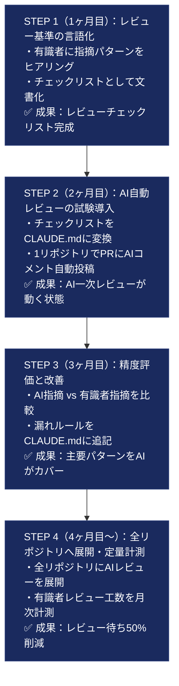
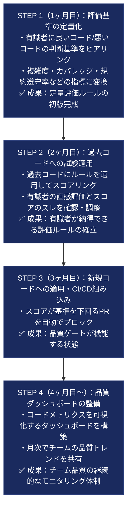
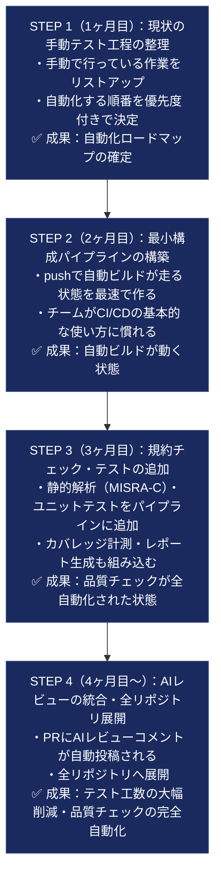
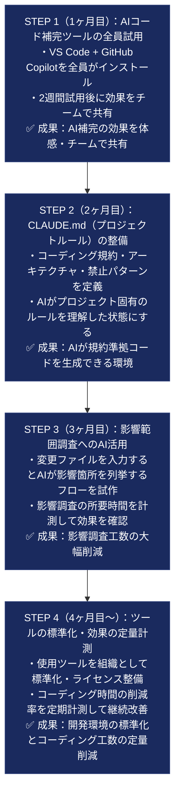
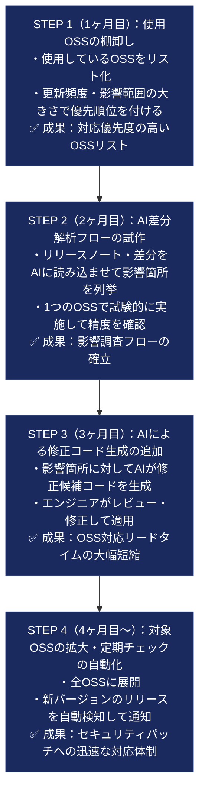
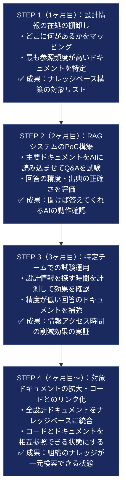
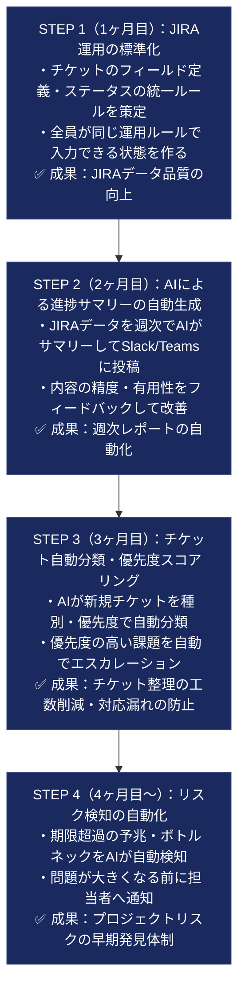
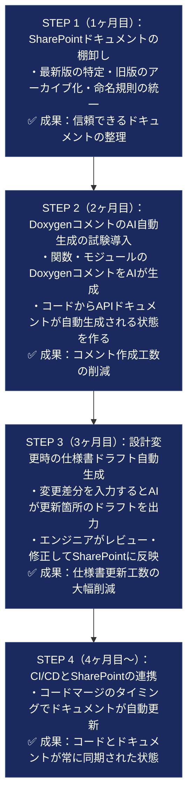
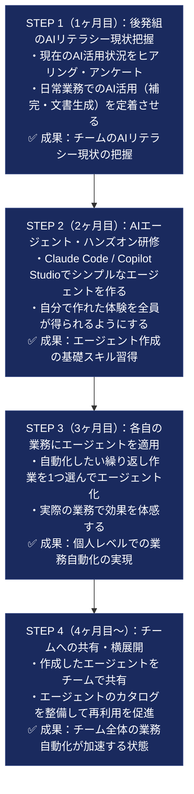
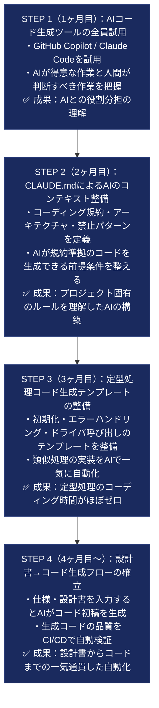

# AI駆動開発 推進計画
## 組み込みソフトウェア開発チーム向け — 10の課題と推進ステップ

---

## 目指す姿

**FY28ソフトウェア開発生産性30%向上をテコに、成長領域・収益領域の2軸経営実現に貢献する**

この目標を達成するために、以下の10の課題に対してAIを段階的に導入する。各課題には現状の問題・解決方法の特徴・推奨理由・具体的な推進フローを記載する。

---

## 10課題の全体俯瞰

| # | 課題テーマ | 現状の問題 | 解決後の姿 |
|---|---|---|---|
| 1 | コードレビュー・効率化 | 有識者にレビューが集中し待ちが長い。内容も属人化 | AIが一次レビューを担い、有識者は高度な判断に集中 |
| 2 | 評価制度の確立 | 評価内容の見える化不足。相互評価不足による品質のばらつき | 定量評価ルールを確立し、評価指標をアナリティクス化 |
| 3 | テストの自動化 | コーディング規約チェック・ビルド・テストが手動。工数が大きい | GitHub Actionsで自動化。規約チェック・ビルド・テストをCI/CDに統合 |
| 4 | 開発環境の改善 | コーディング作業に時間がかかる。変更による影響調査が手作業 | AIがコーディングを補助。影響調査もAIで効率化 |
| 5 | OSS変更の効率化 | OSSアップデート対応が手作業。差分解析・影響調査・修正に工数がかかる | AI活用でOSSの差分解析・影響調査・修正を自動化 |
| 6 | 設計情報の構造化 | 設計情報がドキュメントとコードに分散。必要情報へのアクセスが遅い | 設計情報をAIで構造化・ナレッジベース化。検索・参照を容易にする |
| 7 | JIRA活用の効率化 | チケット管理が属人的。情報が散在し全体像の把握が困難 | AIとJIRAを連携し、自動分類・進捗サマリー・リスク検知を実現 |
| 8 | 設計ドキュメントの整備 | 設計書の作成・更新が後回し。最新・旧資料が混在 | AIで設計書ドラフトを自動生成。SharePoint連携で常に最新を維持 |
| 9 | AI Agentの生成（後発組） | 一部業務でAI自動化が未実現。AIエージェントのスキルが不足 | AIエージェントを作れるスキルを習得し、業務自動化を実現 |
| 10 | コード生成 | コーディングに多くの時間を要する。ドキュメント参照しながらの手作業が多い | AIがコードを自動生成。ドキュメント参照も自動化しコーディング効率を向上 |

---

## 課題別：解決方法の詳細

---

### 課題1：コードレビュー・効率化

**背景**

有識者へのレビュー集中とレビュー待ちの長期化が開発速度のボトルネックになっている。レビュー基準が有識者の頭の中にあり、担当者によって指摘内容にばらつきが生じている。

**解決方法の特徴**

AIがコードを解析してフィードバックを自動生成する。設計ルール・チェック基準を CLAUDE.md（AIへの指示書）として文書化することで、有識者の知識を組織の資産に変換する。AIが対応できる問題は自動化し、有識者は高難度の判断のみを担当する分業体制を作る。

**この方法を推奨する理由**

レビュー待ちというボトルネックが解消され、開発速度が直接向上する。有識者の負担が軽減されることで、疲弊による判断品質の低下も防げる。さらに、有識者の知識が CLAUDE.md として文書化されるため、退職・異動によるナレッジ消失リスクへの対策にもなる。

**推進フロー**



**計測指標**

| 指標 | 目標 |
|---|---|
| レビュー待ち時間 | 現状比 50% 削減 |
| 有識者のレビュー工数 | 現状比 40% 削減 |
| 規約違反の後工程発覚件数 | 現状比 70% 削減 |

---

### 課題2：評価制度の確立

**背景**

有識者が行ってきた評価の基準・内容が明文化されておらず、評価者によって品質判断にばらつきがある。チーム全体での品質水準の統一が難しく、若手エンジニアが「何を目指せばよいか」を理解しにくい状態にある。

**解決方法の特徴**

過去コードの評価基準を、複雑度・テストカバレッジ・規約遵守率などの定量指標に変換する。感覚的だった評価を数値化することで、評価者に依存しない一貫した品質基準をチーム全体で共有できる。評価結果をダッシュボードで可視化し、チームの品質トレンドをマネジメントの判断材料として活用する。

**この方法を推奨する理由**

品質基準が明確になることで、若手エンジニアが目標を持って成長できる環境が生まれる。相互レビューの基準が統一されるため、レビューの質が安定する。また、月次の品質アナリティクスはマネージャーが開発状況を把握するための客観的なデータとなり、属人的な報告に依存しない管理体制を実現できる。

**推進フロー**



---

### 課題3：テストの自動化

**背景**

コーディング規約チェック・ビルド・テスト実行が手動で行われており、実行漏れや環境差異による問題が発生している。テスト工数が大きく、エンジニアの時間が本来の開発以外の作業に取られている。

**解決方法の特徴**

GitHub Actions を使った CI/CD パイプラインを整備し、コードが push されるたびにビルド・規約チェック・テストが自動実行される仕組みを作る。段階的に自動化項目を追加できるため、チームの習熟度に合わせて無理なく拡張できる。完成形では、push のたびに以下がすべて自動で走る。

```
git push → ①クロスコンパイル → ②規約チェック（MISRA-C等）
         → ③ユニットテスト → ④カバレッジ計測 → ⑤AIレビューコメント
         → 全通過でレビュワーへ通知
```

**この方法を推奨する理由**

人が意識しなくてもテストが自動実行されるため、実行漏れや「自分のPCでは動く」問題がなくなる。エンジニアがテスト実行・確認作業から解放され、設計・コーディングに集中できる時間が増える。また、品質チェックが自動化されることで、AIが生成したコードの品質保証も同時に担保できる。

**推進フロー**



---

### 課題4：開発環境の改善

**背景**

コーディング作業そのものに多くの時間がかかっている。コードを変更した際の影響範囲調査（どのファイル・モジュールに波及するか）が手作業で、変更のたびに大きな工数を要している。

**解決方法の特徴**

IDE 内に AI コード補完（GitHub Copilot / Claude Code）を統合し、作業の流れを中断せずにコーディングを進められる環境を作る。影響範囲調査は、変更ファイルを AI に入力するだけで対象箇所が列挙される仕組みを整備する。CLAUDE.md にプロジェクト固有のルール・アーキテクチャを定義することで、AI が規約準拠のコードを生成できる状態にする。

**この方法を推奨する理由**

コーディング時間の削減は生産性 30% 向上に直結する最大の施策の一つ。影響調査の工数が減ることで、変更・リファクタリングに対する心理的ハードルが下がり、技術的負債の解消も進みやすくなる。AI の補助によって若手エンジニアがより高品質なコードを書けるようになり、スキルの底上げ効果もある。

**推進フロー**



---

### 課題5：OSS変更の効率化

**背景**

使用している OSS のバージョンアップ対応が手作業で行われており、差分の確認・影響範囲の調査・コード修正のすべてに大きな工数がかかっている。対応の遅延がセキュリティリスクの蓄積につながっている。

**解決方法の特徴**

OSS のリリースノート・差分を AI に読み込ませて影響箇所を自動列挙する。影響調査結果をもとに AI が修正候補コードを生成し、エンジニアはレビュー・承認に集中できる体制を作る。定期的なアップデートチェックを自動化することで、セキュリティパッチへの対応速度を上げる。

**この方法を推奨する理由**

OSS アップデートの遅延はセキュリティリスクに直結するため、対応速度の向上は製品品質の維持に不可欠。手作業の diff 確認・影響調査がなくなることで、担当者不在時でも対応が継続できる体制を作れる。また、AI が差分解析のノウハウを蓄積することで、対応ごとの品質も安定する。

**推進フロー**



---

### 課題6：設計情報の構造化

**背景**

設計情報が Word・Excel・ソースコードのコメント・Wiki などに分散しており、必要な情報にたどり着くまでに時間がかかる。設計意図がコードに反映されているかの確認も困難で、新メンバーの立ち上がりが遅い。

**解決方法の特徴**

RAG（Retrieval-Augmented Generation）技術を活用し、散在するドキュメントを AI が横断検索するナレッジベースを構築する。エンジニアが「この機能の設計意図は？」と自然言語で質問するだけで、関連ドキュメントを出典付きで即座に得られる状態にする。

**この方法を推奨する理由**

「あの資料どこだっけ」という時間ロスをなくすだけでなく、新メンバーや後発組が過去の設計判断を素早く把握できるためオンボーディングが加速する。ベテランへの「ちょっと聞き」の回数が減り、ベテランの集中を妨げない環境が生まれる。ドキュメントが AI から参照されるようになることで、ドキュメントを整備するインセンティブも高まる。

**推進フロー**



---

### 課題7：JIRA活用の効率化

**背景**

JIRA のチケット管理が担当者ごとに異なるやり方で運用されており、プロジェクト全体の進捗状況・リスクの把握が困難な状態にある。チケットの記載内容もばらつきがあり、マネージャーが状況を把握するための確認コストが高い。

**解決方法の特徴**

AI と JIRA を連携させ、チケットの自動分類・進捗サマリーの自動生成・リスクのある課題（期限超過の予兆・ブロッカー）の自動検知を実現する。マネージャーが毎朝 JIRA を手動で確認しなくても、AI が状況をサマリーして Slack/Teams に自動投稿する体制を作る。

**この方法を推奨する理由**

プロジェクト全体の状況が自動的に可視化されるため、状況報告のための会議や手動集計の工数を削減できる。問題の早期検知により、大きな遅延が発生する前に対処できる。チケット管理の運用が標準化されることで、プロジェクト間での情報品質のばらつきもなくなる。

**推進フロー**



---

### 課題8：設計ドキュメントの整備

**背景**

設計書の作成・更新がコーディング・テストに優先度を奪われて後回しになりがち。SharePoint 上に最新版と旧版が混在しており、どれを参照すればよいか判断が難しい状態にある。

**解決方法の特徴**

AI がコードや変更差分からドキュメントの初稿を自動生成するため、「書くのが大変」という心理的障壁をなくす。SharePoint と CI/CD を連携させ、コードのマージタイミングで関連ドキュメントが自動更新される仕組みを作ることで、コードとドキュメントの乖離を防ぐ。

**この方法を推奨する理由**

ドキュメントが常に最新の状態に保たれることで、設計情報の信頼性が向上し、後から参加したメンバーが正確な情報を参照できるようになる。AI がドキュメントを参照できる状態にすることで、コード生成・レビューの精度も向上する。ドキュメント整備の工数が減ることで、後回しにされがちだった文書化が自然と進む環境が生まれる。

**推進フロー**



**ドキュメント構造の整理案**

```
SharePoint/
├── 現行仕様書/        ← CI/CD が自動更新
├── 設計判断記録(ADR)/ ← 変更理由を蓄積（AI が参照）
├── アーカイブ/        ← 過去バージョン
└── ナレッジベース/    ← AI の学習元ドキュメント
```

---

### 課題9：AI Agentの生成（後発組）

**背景**

チームの一部メンバーはまだ AI をチャットツールとして使う段階にとどまっており、業務フローへの AI 組み込み（AI エージェント化）が実現できていない。AI エージェントの作り方・使い方のスキルが不足している。

**解決方法の特徴**

「まず使ってみる」から「自分で作れる」までを段階的に習得できるカリキュラムを設計する。自分の業務に合ったエージェントを実際に作ることで、学習と実務改善が同時に進む。作成したエージェントをチームで共有・横展開することで、個人学習よりも速くチーム全体のレベルを上げる。

```
通常のAI（チャット）：  人間が都度質問 → AI が回答 → 人間が次の行動を判断
AIエージェント：        人間が目標を与える → AI が自律的に作業を進める → 人間は結果のみ確認
```

**この方法を推奨する理由**

AI を「使う人」と「使えない人」の格差を放置すると、チームの生産性にばらつきが生じ続ける。スキルをチームで共有・横展開する仕組みを作ることで、全員が恩恵を受けられる状態に早期に移行できる。自分の業務を改善した体験が、AI 活用への主体的な参加意識を高め、後発組のメンバーの自信にもつながる。

**推進フロー**



---

### 課題10：コード生成

**背景**

コーディング作業そのものに多くの時間を要しており、仕様書や設計ドキュメントを参照しながら手動でコードを書く作業が大部分を占めている。特に定型的な処理（初期化・エラーハンドリング・ログ出力など）の実装に時間がかかっている。

**解決方法の特徴**

AI が仕様・設計ドキュメントを参照しながらコードの初稿を自動生成する。エンジニアは「コードを書く」役割から「AI が生成したコードをレビュー・修正する」役割に移行する。プロジェクト固有の規約・アーキテクチャを CLAUDE.md に定義することで、生成コードの品質を高い水準に保てる。

**この方法を推奨する理由**

コーディング作業への時間投資を削減することが、生産性 30% 向上への最大の貢献要素の一つ。エンジニアが実装作業から解放されることで、設計・判断という高付加価値の仕事に集中できる環境が生まれる。定型処理のテンプレートが整備されることで、類似機能の実装速度が大幅に向上し、コードの品質・一貫性も高まる。

**推進フロー**



---

## 全体推進スケジュール

```
        1ヶ月目          2ヶ月目          3ヶ月目          4ヶ月目以降
        ────────────────────────────────────────────────────────────────
課題1   ■基準言語化       ■AI試験導入      ■精度評価         ■全展開・計測
課題2   ■定量化策定       ■過去コード試験  ■CI品質ゲート     ■ダッシュボード
課題3   ■工程整理         ■ビルド自動化    ■全自動化         ■AIレビュー統合
課題4   ■ツール試用       ■CLAUDE.md整備   ■影響調査AI       ■標準化・計測
課題5   ■OSS棚卸し        ■差分解析PoC     ■修正コード生成   ■全展開・定期化
課題6   ■情報棚卸し       ■RAG-PoC         ■試験運用         ■全ドキュメント統合
課題7   ■運用標準化       ■サマリー自動化  ■自動分類         ■リスク検知
課題8   ■棚卸し           ■Doxygen自動化   ■仕様書ドラフト   ■CI/CD連携
課題9   ■現状把握         ■研修開始        ■個人エージェント ■チーム横展開
課題10  ■ツール試用       ■CLAUDE.md整備   ■テンプレ整備     ■生成フロー確立
```

---

## 今すぐ着手できること

全課題の準備を待たずに、以下3点は今月中に開始できる。

| 施策 | 所要時間 | なぜ今すぐやるか |
|---|---|---|
| VS Code + GitHub Copilot を全員がインストール・試用 | 半日 | コーディング補助の効果をすぐに体感でき、AI活用の入口になる |
| 会議にCopilot for Teamsを試験導入（議事録の自動生成） | 1日 | ベテランを含む全員にメリットがある。AI抵抗感の低減にも効果的 |
| 有識者へのレビュー基準ヒアリングと文書化 | 1〜2日 | 課題1・2・4の土台になる。AI導入前から組織知の整備として価値がある |

---

## AIを導入する際の基本的な考え方

**AIは有識者を置き換えるものではない**

有識者が長年かけて習得してきた判断力・経験・ノウハウは、AI が簡単に代替できるものではない。AI が担うのは「調べる・書く・チェックする」といった作業の自動化であり、「何が正しいか判断する」役割は引き続き有識者が担う。

**小さく始めて、確実に積み上げる**

全課題を一斉に進めるのではなく、影響範囲が小さく効果が出やすいところから始めて、成功体験を積み上げながら横展開する。失敗しても被害が小さい場所で PoC（試験導入）を行い、そこで得た知見を次に活かす。

**有識者がルールを作る**

AI への指示書（CLAUDE.md など）やレビューチェックリストは、AI 担当者だけでなく有識者が主導して作成する。「AI を管理する側」として関わることで、AI 導入への主体的な参加を促す。
