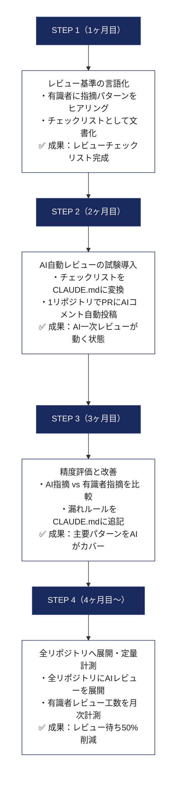
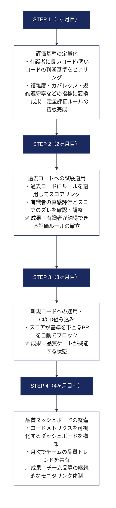
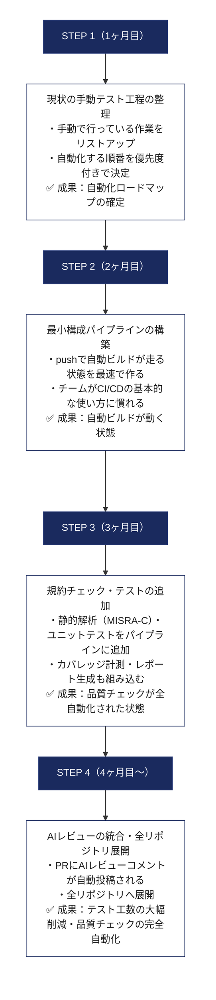
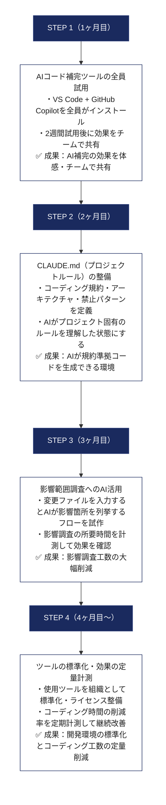
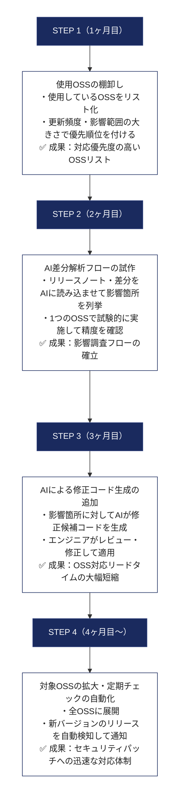
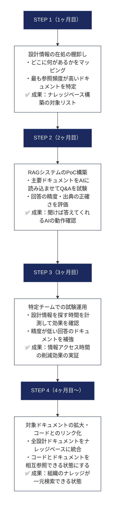
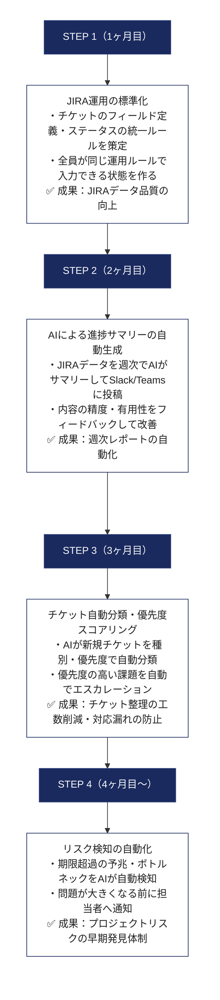
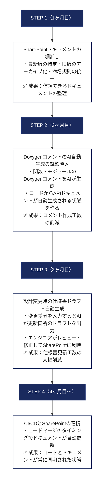
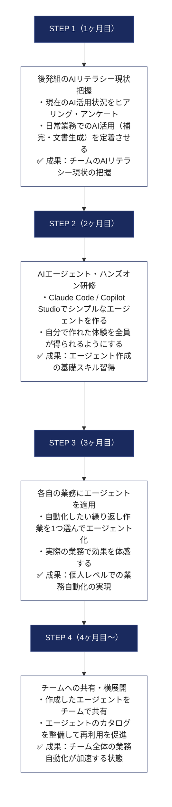
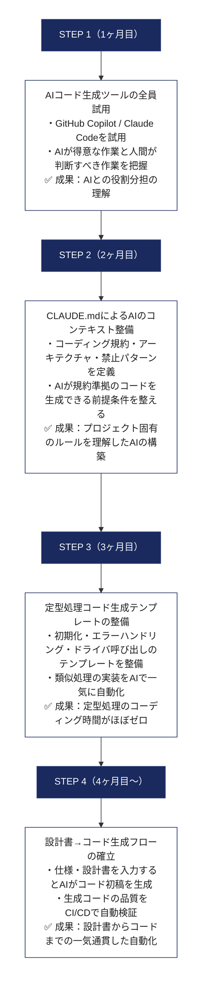

# AI駆動開発 推進計画
## 組み込みソフトウェア開発チーム向け — 10の課題と推進ステップ

---

## 目指す姿

**FY28ソフトウェア開発生産性30%向上をテコに、成長領域・収益領域の2軸経営実現に貢献する**

この目標を達成するために、以下の10の課題に対してAIを段階的に導入する。

---

## 10課題の全体俯瞰

| # | 課題テーマ | 現状の問題 | 解決後の姿 |
|---|---|---|---|
| 1 | コードレビュー・効率化 | 有識者にレビューが集中し待ちが長い。内容も属人化 | AIが一次レビューを担い、有識者は高度な判断に集中 |
| 2 | 評価制度の確立 | 評価内容の見える化不足。相互評価不足による品質のばらつき | 定量評価ルールを確立し、評価指標をアナリティクス化 |
| 3 | テストの自動化 | コーディング規約チェック・ビルド・テストが手動。工数が大きい | GitHub Actionsで自動化。規約チェック・ビルド・テストをCI/CDに統合 |
| 4 | 開発環境の改善 | コーディング作業に時間がかかる。変更による影響調査が手作業 | AIがコーディングを補助。影響調査もAIで効率化 |
| 5 | OSS変更の効率化 | OSSアップデート対応が手作業。差分解析・影響調査・修正に工数がかかる | AI活用でOSSの差分解析・影響調査・修正を自動化 |
| 6 | 設計情報の構造化 | 設計情報がドキュメントとコードに分散。必要情報へのアクセスが遅い | 設計情報をAIで構造化・ナレッジベース化。検索・参照を容易にする |
| 7 | JIRA活用の効率化 | チケット管理が属人的。情報が散在し全体像の把握が困難 | AIとJIRAを連携し、自動分類・進捗サマリー・リスク検知を実現 |
| 8 | 設計ドキュメントの整備 | 設計書の作成・更新が後回し。最新・旧資料が混在 | AIで設計書ドラフトを自動生成。SharePoint連携で常に最新を維持 |
| 9 | AI Agentの生成（後発組） | 一部業務でAI自動化が未実現。AIエージェントのスキルが不足 | AIエージェントを作れるスキルを習得し、業務自動化を実現 |
| 10 | コード生成 | コーディングに多くの時間を要する。ドキュメント参照しながらの手作業が多い | AIがコードを自動生成。ドキュメント参照も自動化しコーディング効率を向上 |

---

## 課題別：解決方法の詳細

---

### 課題1：コードレビュー・効率化

**背景**
- 有識者へのレビュー集中とレビュー待ちの長期化が開発速度のボトルネック
- レビュー基準が有識者の頭の中にあり、担当者によって指摘内容にばらつき

**解決方法**
- AIがコードを解析してフィードバックを自動生成する
- 設計ルール・チェック基準を CLAUDE.md として文書化し、有識者の知識を組織の資産に変換する
- AIが対応できる問題は自動化し、有識者は高難度の判断のみを担当する分業体制を作る

**この方法を推奨する理由**
- レビュー待ちのボトルネックが解消され、開発速度が直接向上する
- 有識者の負担軽減により、疲弊による判断品質の低下も防げる
- 有識者の知識が CLAUDE.md として文書化され、退職・異動によるナレッジ消失リスクへの対策になる

**推進フロー**



**計測指標**

| 指標 | 目標 |
|---|---|
| レビュー待ち時間 | 現状比 50% 削減 |
| 有識者のレビュー工数 | 現状比 40% 削減 |
| 規約違反の後工程発覚件数 | 現状比 70% 削減 |

---

### 課題2：評価制度の確立

**背景**
- 有識者の評価基準が明文化されておらず、評価者によって品質判断にばらつき
- 若手エンジニアが「何を目指せばよいか」を理解しにくい状態

**解決方法**
- 複雑度・テストカバレッジ・規約遵守率などの定量指標で評価基準を数値化する
- 評価者に依存しない一貫した品質基準をチーム全体で共有する
- 評価結果をダッシュボードで可視化し、マネジメントの判断材料として活用する

**この方法を推奨する理由**
- 品質基準が明確になり、若手エンジニアが目標を持って成長できる環境が生まれる
- 月次の品質アナリティクスで、マネージャーが客観的データに基づいた判断ができる
- 相互レビューの基準が統一されるため、レビューの質が安定する

**推進フロー**



---

### 課題3：テストの自動化

**背景**
- コーディング規約チェック・ビルド・テストが手動で行われており、実行漏れや環境差異による問題が発生
- テスト工数が大きく、エンジニアの時間が本来の開発以外の作業に取られている

**解決方法**
- GitHub Actions で CI/CD パイプラインを整備し、push のたびにビルド・規約チェック・テストを自動実行する
- 段階的に自動化項目を追加でき、チームの習熟度に合わせて無理なく拡張できる
- 完成形では push のたびに以下が全自動で走る

```
git push → ①クロスコンパイル → ②規約チェック（MISRA-C等）
         → ③ユニットテスト → ④カバレッジ計測 → ⑤AIレビューコメント
         → 全通過でレビュワーへ通知
```

**この方法を推奨する理由**
- 実行漏れや「自分のPCでは動く」問題がなくなる
- エンジニアがテスト実行・確認作業から解放され、設計・コーディングに集中できる
- AIが生成したコードの品質保証も同時に担保できる

**推進フロー**



---

### 課題4：開発環境の改善

**背景**
- コーディング作業そのものに多くの時間がかかっている
- コード変更時の影響範囲調査が手作業で、変更のたびに大きな工数を要している

**解決方法**
- IDE 内に AI コード補完（GitHub Copilot / Claude Code）を統合し、作業を中断せずにコーディングを進められる環境を作る
- 変更ファイルを AI に入力するだけで影響箇所が列挙される仕組みを整備する
- CLAUDE.md にプロジェクト固有のルール・アーキテクチャを定義し、AI が規約準拠のコードを生成できる状態にする

**この方法を推奨する理由**
- コーディング時間の削減は生産性 30% 向上に直結する最大の施策の一つ
- 影響調査の工数が減り、変更・リファクタリングへの心理的ハードルが下がる
- AI の補助で若手エンジニアがより高品質なコードを書けるようになり、スキルの底上げ効果もある

**推進フロー**



---

### 課題5：OSS変更の効率化

**背景**
- OSS のバージョンアップ対応が手作業で、差分確認・影響調査・コード修正すべてに大きな工数がかかっている
- 対応の遅延がセキュリティリスクの蓄積につながっている

**解決方法**
- OSS のリリースノート・差分を AI に読み込ませて影響箇所を自動列挙する
- 影響調査結果をもとに AI が修正候補コードを生成し、エンジニアはレビュー・承認に集中できる体制を作る
- 定期的なアップデートチェックを自動化し、セキュリティパッチへの対応速度を上げる

**この方法を推奨する理由**
- OSS アップデートの遅延はセキュリティリスクに直結するため、対応速度の向上は製品品質の維持に不可欠
- 手作業の diff 確認・影響調査がなくなり、担当者不在時でも対応が継続できる体制を作れる
- AI が差分解析のノウハウを蓄積することで、対応ごとの品質が安定する

**推進フロー**



---

### 課題6：設計情報の構造化

**背景**
- 設計情報が Word・Excel・コードコメント・Wiki などに分散しており、必要な情報にたどり着くまでに時間がかかる
- 新メンバーの立ち上がりが遅く、ベテランへの「ちょっと聞き」が頻発している

**解決方法**
- RAG（Retrieval-Augmented Generation）技術で、散在するドキュメントを AI が横断検索するナレッジベースを構築する
- 自然言語で質問するだけで、関連ドキュメントを出典付きで即座に得られる状態にする

**この方法を推奨する理由**
- 「あの資料どこだっけ」という時間ロスがなくなり、情報探索の工数が削減される
- 新メンバーが過去の設計判断を素早く把握できるためオンボーディングが加速する
- ドキュメントが AI から参照されるようになることで、整備するインセンティブも高まる

**推進フロー**



---

### 課題7：JIRA活用の効率化

**背景**
- JIRA のチケット管理が担当者ごとに異なるやり方で運用されており、全体の進捗・リスクの把握が困難
- チケットの記載内容にばらつきがあり、マネージャーが状況把握するための確認コストが高い

**解決方法**
- AI と JIRA を連携させ、チケットの自動分類・進捗サマリーの自動生成・リスク課題の自動検知を実現する
- AI が状況をサマリーして Slack/Teams に自動投稿する体制を作る

**この方法を推奨する理由**
- 状況報告のための会議や手動集計の工数を削減できる
- 問題の早期検知により、大きな遅延が発生する前に対処できる
- チケット管理の運用が標準化され、プロジェクト間での情報品質のばらつきもなくなる

**推進フロー**



---

### 課題8：設計ドキュメントの整備

**背景**
- 設計書の作成・更新がコーディング・テストに優先度を奪われて後回しになりがち
- SharePoint 上に最新版と旧版が混在しており、どれを参照すればよいか判断が難しい

**解決方法**
- AI がコードや変更差分からドキュメントの初稿を自動生成し、「書くのが大変」という心理的障壁をなくす
- SharePoint と CI/CD を連携させ、コードのマージタイミングで関連ドキュメントが自動更新される仕組みを作る

**この方法を推奨する理由**
- ドキュメントが常に最新の状態に保たれ、設計情報の信頼性が向上する
- AI がドキュメントを参照できる状態になることで、コード生成・レビューの精度も向上する
- ドキュメント整備の工数が減り、後回しにされがちだった文書化が自然と進む

**推進フロー**



**ドキュメント構造の整理案**

```
SharePoint/
├── 現行仕様書/        ← CI/CD が自動更新
├── 設計判断記録(ADR)/ ← 変更理由を蓄積（AI が参照）
├── アーカイブ/        ← 過去バージョン
└── ナレッジベース/    ← AI の学習元ドキュメント
```

---

### 課題9：AI Agentの生成（後発組）

**背景**
- チームの一部メンバーはまだ AI をチャットツールとして使う段階にとどまっており、業務への AI 組み込みが実現できていない
- AI エージェントの作り方・使い方のスキルが不足している

**解決方法**
- 「まず使ってみる」から「自分で作れる」までを段階的に習得できるカリキュラムを設計する
- 自分の業務に合ったエージェントを実際に作ることで、学習と実務改善を同時に進める
- 作成したエージェントをチームで共有・横展開することで、チーム全体のレベルを速く上げる

```
通常のAI（チャット）：  人間が都度質問 → AI が回答 → 人間が次の行動を判断
AIエージェント：        人間が目標を与える → AI が自律的に作業を進める → 人間は結果のみ確認
```

**この方法を推奨する理由**
- AI を「使う人」と「使えない人」の格差を放置すると、チームの生産性にばらつきが生じ続ける
- スキルをチームで共有・横展開することで、全員が恩恵を受けられる状態に早期に移行できる
- 自分の業務を改善した体験が、AI 活用への主体的な参加意識と自信につながる

**推進フロー**



---

### 課題10：コード生成

**背景**
- コーディング作業そのものに多くの時間を要しており、仕様書・設計ドキュメントを参照しながらの手作業が大部分を占めている
- 特に定型的な処理（初期化・エラーハンドリング・ログ出力など）の実装に時間がかかっている

**解決方法**
- AI が仕様・設計ドキュメントを参照しながらコードの初稿を自動生成する
- エンジニアは「コードを書く」役割から「AI が生成したコードをレビュー・修正する」役割に移行する
- CLAUDE.md にプロジェクト固有の規約・アーキテクチャを定義し、生成コードの品質を高い水準に保つ

**この方法を推奨する理由**
- コーディング作業への時間投資の削減が、生産性 30% 向上への最大の貢献要素の一つ
- エンジニアが実装作業から解放され、設計・判断という高付加価値の仕事に集中できる
- 定型処理のテンプレートが整備されることで、類似機能の実装速度と品質・一貫性が向上する

**推進フロー**



---

## 全体推進スケジュール

```
        1ヶ月目          2ヶ月目          3ヶ月目          4ヶ月目以降
        ────────────────────────────────────────────────────────────────
課題1   ■基準言語化       ■AI試験導入      ■精度評価         ■全展開・計測
課題2   ■定量化策定       ■過去コード試験  ■CI品質ゲート     ■ダッシュボード
課題3   ■工程整理         ■ビルド自動化    ■全自動化         ■AIレビュー統合
課題4   ■ツール試用       ■CLAUDE.md整備   ■影響調査AI       ■標準化・計測
課題5   ■OSS棚卸し        ■差分解析PoC     ■修正コード生成   ■全展開・定期化
課題6   ■情報棚卸し       ■RAG-PoC         ■試験運用         ■全ドキュメント統合
課題7   ■運用標準化       ■サマリー自動化  ■自動分類         ■リスク検知
課題8   ■棚卸し           ■Doxygen自動化   ■仕様書ドラフト   ■CI/CD連携
課題9   ■現状把握         ■研修開始        ■個人エージェント ■チーム横展開
課題10  ■ツール試用       ■CLAUDE.md整備   ■テンプレ整備     ■生成フロー確立
```

---

## 今すぐ着手できること

全課題の準備を待たずに、以下3点は今月中に開始できる。

| 施策 | 所要時間 | なぜ今すぐやるか |
|---|---|---|
| VS Code + GitHub Copilot を全員がインストール・試用 | 半日 | コーディング補助の効果をすぐに体感でき、AI活用の入口になる |
| 会議にCopilot for Teamsを試験導入（議事録の自動生成） | 1日 | ベテランを含む全員にメリットがある。AI抵抗感の低減にも効果的 |
| 有識者へのレビュー基準ヒアリングと文書化 | 1〜2日 | 課題1・2・4の土台になる。AI導入前から組織知の整備として価値がある |

---

## AIを導入する際の基本的な考え方

**AIは有識者を置き換えるものではない**

- AI が担うのは「調べる・書く・チェックする」といった作業の自動化
- 「何が正しいか判断する」役割は引き続き有識者が担う
- 有識者が長年かけて習得してきた判断力・経験・ノウハウは、AI が簡単に代替できるものではない

**小さく始めて、確実に積み上げる**

- 影響範囲が小さく効果が出やすいところから始めて、成功体験を積み上げながら横展開する
- 失敗しても被害が小さい場所で PoC（試験導入）を行い、そこで得た知見を次に活かす

**有識者がルールを作る**

- AI への指示書（CLAUDE.md など）やレビューチェックリストは、有識者が主導して作成する
- 「AI を管理する側」として関わることで、AI 導入への主体的な参加を促す
